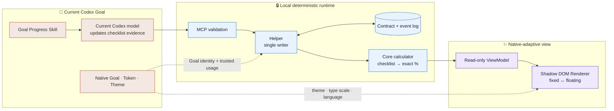

# Codex Goal Progress


Optional, deterministic checklist progress for native Codex Goals.

## ✨ Why it feels native

Goal Progress places a compact progress view next to Codex's native Goal:

| Capability | What it does |
|---|---|
| 🎨 Theme-aware | Follows Codex Light/Dark mode and the user's current accent color. |
| 🔤 Type-aware | Reads the live Codex UI font size and derives spacing from it instead of freezing one layout. |
| 📐 Layout-aware | Measures the real native Goal and composer geometry, then keeps fixed and draggable floating layouts aligned. |
| 🌍 Language-aware | Follows the Codex document language and direction without changing the progress Contract. |
| ✅ Deterministic | Calculates objective and overall progress from a validated checklist, not from guesses, Token usage, or elapsed time. |
| 🔒 Local-first | Uses the current Codex model and a local Helper. No second model, hidden task, or external model API key. |

The compact view shows the current objective, local objective progress, overall progress, and
trusted Token usage when Codex can attribute it to the current Goal.

## 🌓 Light and Dark

### Light

| Fixed view | Floating view |
|---|---|
|  |  |

### Dark

| Fixed view | Floating view |
|---|---|
|  |  |

All four screenshots come from the production Renderer mounted beside a real native Goal in
Codex Desktop.

## 🚀 Build from source

Requirements:

- macOS on Apple Silicon;
- Node.js 22.12 or newer;
- pnpm 11.

```bash
git clone https://github.com/Ezra-Y/codex-goal-progress.git
cd codex-goal-progress
pnpm install --frozen-lockfile
pnpm build
```

Build the self-contained macOS release with a Node 24.19 arm64 binary:

```bash
GOAL_PROGRESS_NODE_BINARY=/absolute/path/to/node-v24.19.0-arm64 \
  pnpm build:release:macos
```

The release is written to:

```text
dist/release/macos-arm64
```

## Install

From the built release directory, run:

```bash
./bin/goal-progress install --json
```

The installer tells you when Codex must reconnect or review a Hook. It never silently closes
Codex and never writes Hook trust on the user's behalf.

Check the installation:

```bash
./bin/goal-progress doctor --json
./bin/goal-progress verify --json
```

## Use

Select the **Goal Progress** Skill inside a native Goal. The current Codex model prepares or
reuses the Goal checklist and initializes one local progress Contract.

Each new native Goal must enable Goal Progress explicitly. Ordinary Codex Goals remain unchanged.

## 🧭 How it works



- The current model updates checklist evidence through local MCP tools.
- Helper validates revisions and is the only state writer.
- Core derives objective and overall progress.
- Renderer receives a display-only ViewModel through the Codex adapter.
- The installer uses a self-contained Node SEA Helper.

Read the [architecture decision](docs/decisions/CodexGoalProgress技术架构.md),
[permissions](docs/architecture/PERMISSIONS.md), and
[threat model](docs/quality/THREAT-MODEL.md) for details.

## 🔐 Privacy and permissions

Goal Progress runs locally. It does not require Screen Recording, Accessibility, Camera,
Microphone, or Full Disk Access.

It uses:

- local files under its application-support directory;
- a private local Unix socket;
- a loopback CDP connection to the verified Codex process;
- a background Helper registered through launchd;
- three reviewable Plugin Hooks.

See [PERMISSIONS.md](docs/architecture/PERMISSIONS.md) for the exact scope and removal steps.

## Development

```bash
pnpm lint
pnpm typecheck
pnpm build
```

See [CONTRIBUTING.md](CONTRIBUTING.md) before opening a pull request.

## Status

The public source version is stored only in [`VERSION`](VERSION). Development and internal
release-candidate numbers are not exported to this repository.

## License

[MIT](LICENSE)

## ⚠️ Before you install

> [!WARNING]
> This repository is a source preview. The project currently supports only the Codex Desktop
> versions listed in the [support matrix](docs/quality/SUPPORT-MATRIX.md). Build and verify the
> release locally before installing it.
