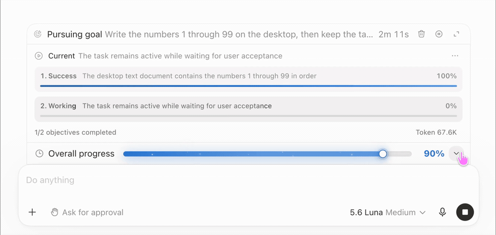
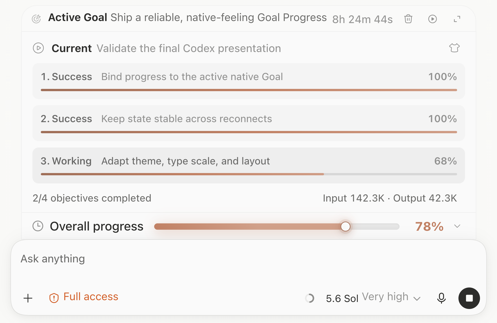
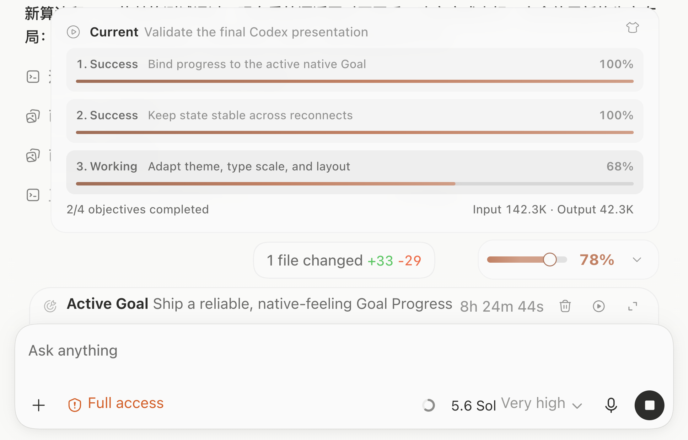
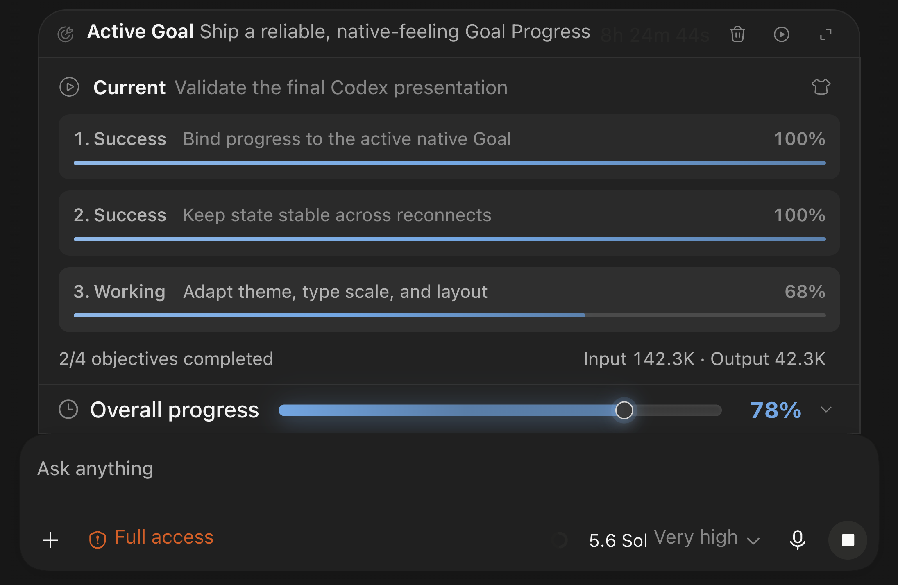
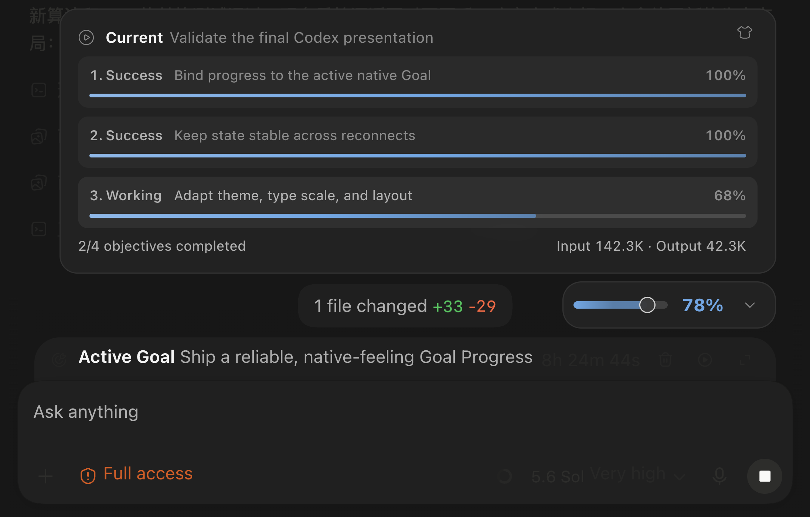
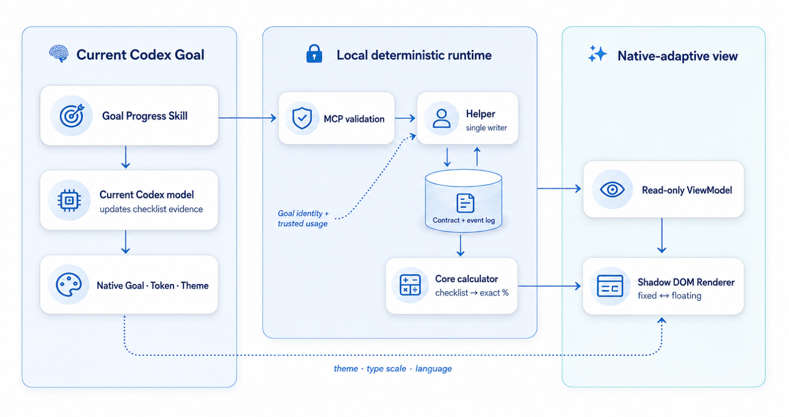

<h1 align="center">Codex Goal Progress</h1>

<p align="center">
  
</p>

<p align="center">
  <a href="README.md">English</a> · <strong>简体中文</strong>
</p>

<p align="center">为 Codex 原生 Goal 提供可选、确定性的 Checklist 进度。</p>

## ✨ 功能特性

在 Codex 原生 Goal 旁显示一个的进度视图，集中展示当前阶段进度、总体进度，以及可归属于该 Goal 的 Token 用量。

| 能力 | 表现 |
|---|---|
| 规则驱动进度 | 根据已验证的 Checklist 计算小目标和总体进度，不根据 Token、耗时或猜测生成百分比。 |
| 可验证计算 | 模型只参与必要的目标理解与 Checklist 更新，进度计算和状态管理由本地 Helper 完成。 |
| 原生主题适配 | 跟随 Codex 的浅色/深色主题和用户当前选择的强调色。 |
| 字号适配 | 读取 Codex 当前 UI 字号，并由字号连续计算间距。 |
| 布局适配 | 测量真实原生 Goal 和输入框尺寸，让固定布局与可拖动漂浮布局保持协调。 |
| 语言适配 | 跟随 Codex 文档的语言和文字方向，不修改进度 Contract。 |

## 🚀 快速开始

### 让 AI 安装

把下面这句话发给 AI：

```text
请安装并启用 https://github.com/Ezra-Y/codex-goal-progress。安装完成后运行 doctor 和 verify，确认它可以正常工作。
```

### 自己安装

从源码构建：

```bash
git clone https://github.com/Ezra-Y/codex-goal-progress.git
cd codex-goal-progress

pnpm install --frozen-lockfile
pnpm build

GOAL_PROGRESS_NODE_BINARY="$PWD/.cache/node-v24.19.0/node-v24.19.0-darwin-arm64/bin/node" \
  pnpm build:release:macos

./dist/release/macos-arm64/bin/goal-progress install --json
./dist/release/macos-arm64/bin/goal-progress doctor --json
./dist/release/macos-arm64/bin/goal-progress verify --json
```

把 Node 路径替换为本机实际路径。安装时按提示重新连接 Codex 或审核 Hook。

## 🛠️ 环境要求

* Apple Silicon Mac
* Node.js 22.12 或更高版本
* pnpm 11
* 构建 macOS Release 时，需要 Node.js 24.19.0 arm64 二进制文件

### 准备 Node 24.19.0 arm64

从 Node.js 官方 Release 下载 macOS arm64 文件和 SHA-256 清单：

```bash
NODE_RELEASE_DIR="$PWD/.cache/node-v24.19.0"
mkdir -p "$NODE_RELEASE_DIR"
cd "$NODE_RELEASE_DIR"

curl -fLO https://nodejs.org/download/release/v24.19.0/node-v24.19.0-darwin-arm64.tar.gz
curl -fLO https://nodejs.org/download/release/v24.19.0/SHASUMS256.txt

grep '  node-v24.19.0-darwin-arm64.tar.gz$' SHASUMS256.txt \
  | shasum -a 256 -c -
tar -xzf node-v24.19.0-darwin-arm64.tar.gz

NODE_BINARY="$NODE_RELEASE_DIR/node-v24.19.0-darwin-arm64/bin/node"
"$NODE_BINARY" -p 'process.version + " " + process.arch'
file "$NODE_BINARY"

cd ../..
```

版本检查应显示 `v24.19.0 arm64`，`file` 应显示 Mach-O arm64。

构建完成的 Release 位于：

```text
dist/release/macos-arm64
```

## 🎯 如何使用

打开一个原生 Codex Goal，然后选择 **Goal Progress** Skill。

当前 Codex 模型会整理或复用该 Goal 的 Checklist，并创建本地进度记录。

每个新 Goal 都需要单独启用一次。没有启用 Goal Progress 的普通 Goal 不受影响。

## 🌓 浅色与深色

### 浅色

| 固定显示 | 漂浮显示 |
|---|---|
|  |  |

### 深色

| 固定显示 | 漂浮显示 |
|---|---|
|  |  |

## 🧭 工作原理

<p align="center">
  
</p>

- 当前模型通过本地 MCP 工具更新 Checklist 证据。
- Helper 校验 revision，并作为唯一状态写入者。
- Core 根据 Checklist 计算小目标进度和总体进度。
- Renderer 只接收展示用 ViewModel。
- 安装器使用自包含的 Node SEA Helper。

更多信息见[技术架构](docs/decisions/CodexGoalProgress技术架构.md)、
[权限范围](docs/architecture/PERMISSIONS.md)和
[威胁模型](docs/quality/THREAT-MODEL.md)。

## 🔐 隐私与权限

Goal Progress 使用：

- 应用支持目录中的本地文件；
- 私有本地 Unix Socket；
- 连接已验证 Codex 进程的 loopback CDP；
- 由 launchd 注册的后台 Helper；
- 三个可以审核的 Plugin Hook。

完整范围和卸载步骤见 [PERMISSIONS.md](docs/architecture/PERMISSIONS.md)。

## 许可证

[MIT](LICENSE)
