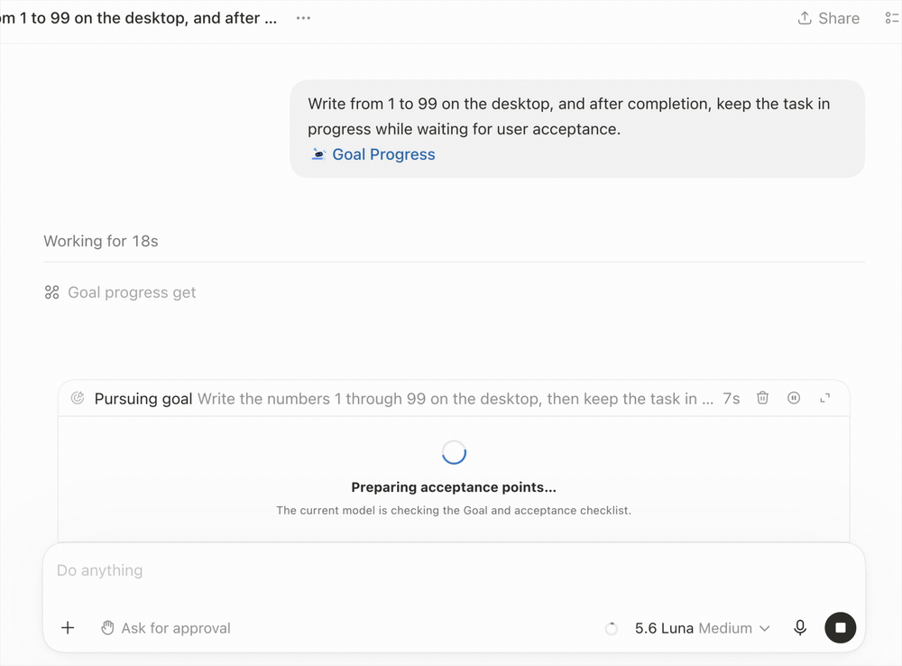

<div align="center">
  <h1 align="center">
    <br>
    Codex Goal Progress
  </h1>
  <p>为 Codex 原生 Goal 提供由已验证清单和本地进度追踪驱动的进度条。</p>
  <p>
    <a href="https://github.com/Ezra-Y/codex-goal-progress/blob/main/README.md">English</a> ·
    <strong>简体中文</strong>
  </p>
</div>

<p align="center">
  
</p>

## 🆕 最近更新

### 🚑 v0.3.4 — Codex 更新恢复与旧任务兼容

**更新日期：2026 年 9 月 2 日**

这一轮主要解决 Codex 或插件更新后，进度条突然失效的问题。

- 🔄 **Codex 更新后自动恢复。** Codex 替换浏览器进程时，Goal Progress 会识别旧连接已经失效，
  自动接入新进程并重新显示进度条，不再需要手动重启 Helper。
- 🧭 **旧任务也能正常启用。** 已经打开或恢复的旧任务，即使会话 Hook 没有刷新，也不会再因为
  `HOOK_CONTEXT_REQUIRED` 无法启用进度条。
- 🔐 **任务身份继续隔离。** Goal 工具可以读取 Codex 自带的请求身份，Helper 再精确核对真实线程。
  模型参数只作用于当前已验证任务，子 Agent 保持只读隔离。
- 🪝 **升级后 Hook 信任自动同步。** 无论用户来自更早版本，还是 v0.3.3 的 Hook 配置，安装器都会
  更新为当前可信配置。
- 🏷️ **当前版本显示准确。** 使用安装器或命令行升级后，更多菜单会显示当前正在运行的 Helper 版本，
  检查更新仍然比较真实的本地版本和远端版本。
- ⚡ **仍然没有常驻轮询。** 只有浏览器连接真实断开时才触发有限重连，正常使用时不会持续扫描窗口。

这是最新版本。更多内容请查看[完整更新记录](CHANGELOG.md)。

## ✨ 功能特性

在 Codex 原生 Goal 旁显示进度视图，集中展示当前小目标、总体进度，以及能够确认归属于该 Goal 的 Token 用量。

| 能力 | 表现 |
|---|---|
| 规则驱动进度 | 根据已验证的 Checklist 计算小目标和总体进度；Token 与耗时保持为独立辅助信息。 |
| 可验证计算 | 模型只负责必要的 Goal 理解和 Checklist 更新；本地 Helper 管理状态并计算进度。 |
| 原生主题适配 | 跟随 Codex 的浅色/深色主题和用户当前选择的强调色。 |
| 字号适配 | 读取 Codex 当前 UI 字号，并由字号连续计算间距。 |
| 布局适配 | 测量真实原生 Goal 和输入框尺寸，协调固定布局与可拖动漂浮布局。 |
| 语言适配 | 读取 Codex 当前文档语言和文字方向，选择对应的内置词典，并以英文作为最终回退。 |

## 🚀 快速开始

### 让 AI 安装

把下面这句话发给 AI：

```text
请按照仓库中的 INSTALL-FOR-AI.md，安装并验证 https://github.com/Ezra-Y/codex-goal-progress。
```

### 在终端一行安装

```bash
curl -fsSL https://github.com/Ezra-Y/codex-goal-progress/releases/latest/download/install.sh | sh
```

脚本会下载 macOS 安装包和 `SHA256SUMS`，校验 ZIP，然后运行安装包内置的安装器。
需要重启 Codex 时，脚本会先询问。

安装后按提示重新打开 Codex，再打开一个新任务，让新的 Plugin 会话加载。

## 🛠️ 环境要求

- Apple Silicon Mac
- Codex Desktop

macOS 安装包已经包含运行时。

## 🎯 如何使用

打开一个原生 Codex Goal，然后选择 **Goal Progress** Skill。

当前 Codex 模型会整理或复用该 Goal 的 Checklist，并创建本地进度记录。

每个新 Goal 需要单独启用 Goal Progress。普通 Goal 继续使用 Codex 原生流程。

## 🌓 进度状态与主题

### 正在准备验收清单

<p align="center">
  
</p>

### 浅色

| 固定显示 | 漂浮显示 |
|---|---|
|  |  |

### 深色

| 固定显示 | 漂浮显示 |
|---|---|
|  |  |

## 🧭 工作原理

<p align="center">
  
</p>

- 当前模型通过本地 MCP 工具更新 Checklist 证据。
- Helper 校验 revision，并作为唯一状态写入者。
- Core 根据 Checklist 计算小目标进度和总体进度。
- Renderer 只接收用于显示的 ViewModel。
- 安装器使用自包含的 Node SEA Helper。

更多信息请查看[技术架构](https://github.com/Ezra-Y/codex-goal-progress/blob/main/docs/ARCHITECTURE.md)、
[权限范围](https://github.com/Ezra-Y/codex-goal-progress/blob/main/docs/PERMISSIONS.md)和
[支持说明](https://github.com/Ezra-Y/codex-goal-progress/blob/main/docs/SUPPORT.md)。

## 🔐 隐私与权限

Goal Progress 使用：

- 应用支持目录中的本地文件；
- 私有本地 Unix Socket；
- 连接已验证 Codex 进程的 loopback CDP；
- 由 launchd 注册的后台 Helper；
- 三个可审核的 Plugin Hook。

完整范围和卸载步骤请查看
[PERMISSIONS.md](https://github.com/Ezra-Y/codex-goal-progress/blob/main/docs/PERMISSIONS.md)。

## 许可证

[MIT](https://github.com/Ezra-Y/codex-goal-progress/blob/main/LICENSE)
