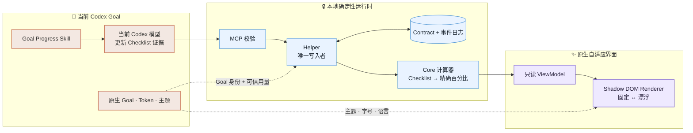

<h1 align="center">Codex Goal Progress</h1>

<p align="center">
  
</p>

<p align="center">
  <a href="README.md">English</a> · <strong>简体中文</strong>
</p>

<p align="center">为 Codex 原生 Goal 提供可选、确定性的 Checklist 进度。</p>

## ✨ 为什么它看起来像原生功能

Goal Progress 在 Codex 原生 Goal 旁边增加一个紧凑的进度视图：

| 能力 | 表现 |
|---|---|
| 🎨 适配主题 | 跟随 Codex 的浅色/深色主题和用户当前选择的强调色。 |
| 🔤 适配字号 | 读取 Codex 当前 UI 字号，并由字号连续计算间距，不把布局写死。 |
| 📐 适配布局 | 测量真实原生 Goal 和输入框尺寸，让固定布局与可拖动漂浮布局保持协调。 |
| 🌍 适配语言 | 跟随 Codex 文档的语言和文字方向，不修改进度 Contract。 |
| ✅ 确定性计算 | 根据已验证的 Checklist 计算小目标和总体进度，不根据 Token、耗时或猜测生成百分比。 |
| 🔒 本地运行 | 使用当前 Codex 模型和本地 Helper，不启动第二个模型或隐藏任务，也不需要外部模型 API Key。 |

紧凑视图会显示当前小目标、小目标进度、总体进度，以及 Codex 能可靠归属给当前
Goal 的 Token 用量。

## 🌓 浅色与深色

### 浅色

| 固定显示 | 漂浮显示 |
|---|---|
|  |  |

### 深色

| 固定显示 | 漂浮显示 |
|---|---|
|  |  |

四张截图均来自生产 Renderer，组件挂载在真实 Codex Desktop 原生 Goal 旁边。

## 🚀 从源码构建

环境要求：

- Apple Silicon Mac；
- Node.js 22.12 或更高版本；
- pnpm 11。

```bash
git clone https://github.com/Ezra-Y/codex-goal-progress.git
cd codex-goal-progress
pnpm install --frozen-lockfile
pnpm build
```

使用 Node 24.19 arm64 构建自包含的 macOS Release：

```bash
GOAL_PROGRESS_NODE_BINARY=/absolute/path/to/node-v24.19.0-arm64 \
  pnpm build:release:macos
```

Release 输出到：

```text
dist/release/macos-arm64
```

## 安装

进入构建完成的 Release 目录，运行：

```bash
./bin/goal-progress install --json
```

安装器会明确告诉你是否需要让 Codex 重新连接或审核 Hook。它不会静默关闭 Codex，
也不会替用户写入 Hook 信任。

检查安装结果：

```bash
./bin/goal-progress doctor --json
./bin/goal-progress verify --json
```

## 使用

在原生 Goal 中选择 **Goal Progress** Skill。当前 Codex 模型会整理或复用 Goal
Checklist，并初始化一份本地进度 Contract。

每个新的原生 Goal 都要显式开启一次 Goal Progress。普通 Codex Goal 不受影响。

## 🧭 工作原理



- 当前模型通过本地 MCP 工具更新 Checklist 证据。
- Helper 校验 revision，并作为唯一状态写入者。
- Core 根据 Checklist 计算小目标进度和总体进度。
- Renderer 只接收展示用 ViewModel。
- 安装器使用自包含的 Node SEA Helper。

更多信息见[技术架构](docs/decisions/CodexGoalProgress技术架构.md)、
[权限范围](docs/architecture/PERMISSIONS.md)和
[威胁模型](docs/quality/THREAT-MODEL.md)。

## 🔐 隐私与权限

Goal Progress 使用：

- 应用支持目录中的本地文件；
- 私有本地 Unix Socket；
- 连接已验证 Codex 进程的 loopback CDP；
- 由 launchd 注册的后台 Helper；
- 三个可以审核的 Plugin Hook。

完整范围和卸载步骤见 [PERMISSIONS.md](docs/architecture/PERMISSIONS.md)。

## 开发

```bash
pnpm lint
pnpm typecheck
pnpm build
```

提交 Pull Request 前请阅读 [CONTRIBUTING.md](CONTRIBUTING.md)。

## 版本

对外源码版本只保存在 [`VERSION`](VERSION) 中。内部开发版本和 Release Candidate
编号不会导出到这个仓库。

## 许可证

[MIT](LICENSE)

## ⚠️ 安装前请注意

> [!WARNING]
> 当前仓库是源码预览。项目只支持[支持矩阵](docs/quality/SUPPORT-MATRIX.md)中列出的
> Codex Desktop 版本。安装前请在本机完成构建和验证。
